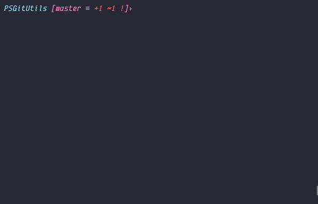

# PSGitUtils

Providers emoji supports for Git commit and Git log.

## Install

```powershell
> Install-Module -Name PSGitUtils
```

# Usage

- Invoke-GitCommit

  Same as `git commit -m`, but provides choices of types. It would generate the message like `[<emoji> ][<type>: ]<message>`. You can modify `$GitUtilsConfig` to decide whether or not generating emoji and type.

  ```powershell
  > Invoke-GitCommit "New Commit"
  > ggc "New Commit"
  ```

- Invoke-GitHistory

  Same as `git log --color --graph --pretty=format:'%Cred%h%Creset -%C(yellow)%d%Creset %s %Cgreen(%cr) %C(bold blue)<%an>%Creset'`, but replaces [Gitmoji code](https://gitmoji.carloscuesta.me/) with emoji.

  ```powershell
  > Invoke-GitHistory
  > Invoke-GitHistory 20
  > ggh
  > ggh 20
  ```

- GitUtilsConfig

  ```powershell
  > $GitUtilsConfig.Type = $True  # determine whether to show [type: ]
  > $GitUtilsConfig.Emoji = $True # determine whether to show [emoji ] after [type: ]
  ```

- Other Aliases

  ```powershell
  > gga # git add, default git add .
  > ggb # git branch, default git branch -av
  > ggck # git checkout
  > ggd # git diff
  > ggpl # git pull
  > ggps # git push
  > ggrst # git reset
  > ggs # git status
  ```

## Best Practices

```powershell
# open default profile
> notepad $PROFILE
# copy the following code and paste it into $PROFILE
if (Get-Module PSGitUtils -ListAvailable) {
  Set-Alias ga gga
  Set-Alias gb ggb
  Set-Alias gck ggck
  Remove-Item 'Alias:\gcm' -Force
  Set-Alias gcm ggc
  Set-Alias gcmd Get-Command
  Set-Alias gd ggd
  Set-Alias gh ggl
  Set-Alias gpl ggpl
  Remove-Item 'Alias:\gps' -Force
  Set-Alias gps ggps
  Set-Alias grst ggrst
  Set-Alias gs ggs
}

# use (some examples...)
> gs # git status
> gh # git log
> gcm # git commit -m
```



## References

- [Gitmoji](https://gitmoji.carloscuesta.me/)

- [Semantic Commit Messages](https://seesparkbox.com/foundry/semantic_commit_messages)

- [git commit emoji 使用指南](https://github.com/liuchengxu/git-commit-emoji-cn)
